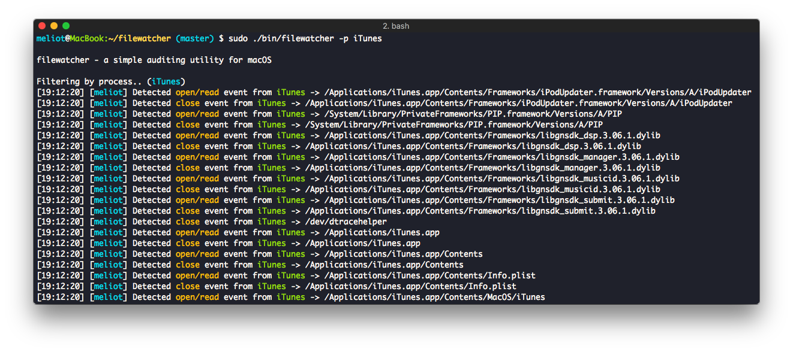

# filewatcher
## a simple auditing utility for macOS

Filewatcher is an auditing and monitoring utility for macOS.

It can audit all events from the system auditpipe of macOS and filter them by process or by file
You can use this utility to:
 - Monitor access to a file, or a group of files.
 - Monitor activity of a process, and which resources are accessed by that process.
 - Build a small Host-Based IDS by monitoring access or modifications to specific files.
 - Do an dynamic malware analysis by monitoring what the malware is using on the filesystem.


If you want to read more about how it works, [check my blog](https://m3liot.github.io/2017/07/02/mac-os-real-time-auditing/).


### Installation
Just run <i>make</i> to compile it and then <i>./bin/filewatcher</i>.

```
Usage: ./bin/filewatcher [OPTIONS]
  -f, --file            Set a file to filter
  -p, --process         Set a process name to filter
  -a, --all             Display all events (By default only basic events like open/read/write are displayed)
  -d, --debug           Enable debugging messages to be saved into a file
  -h, --help            Print this help and exit
```
### Expected output:
<p align="center">

</p>
